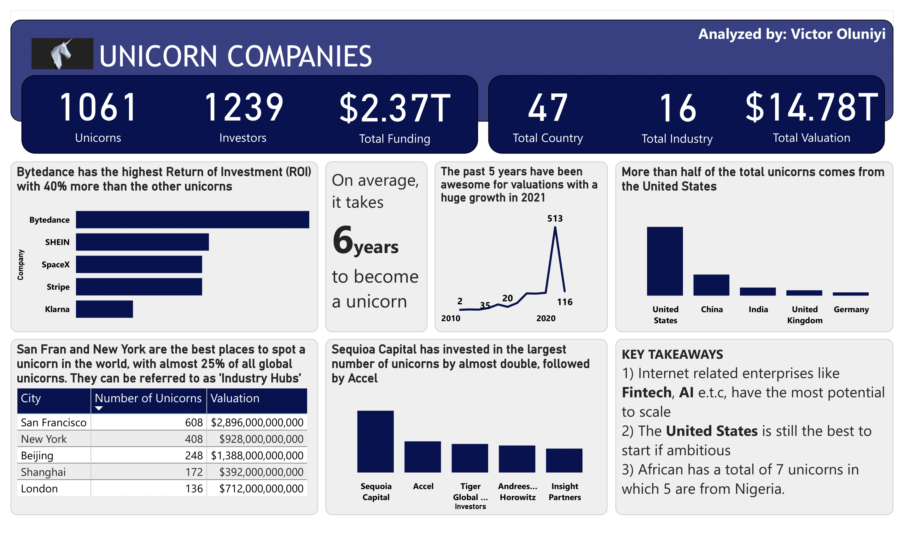
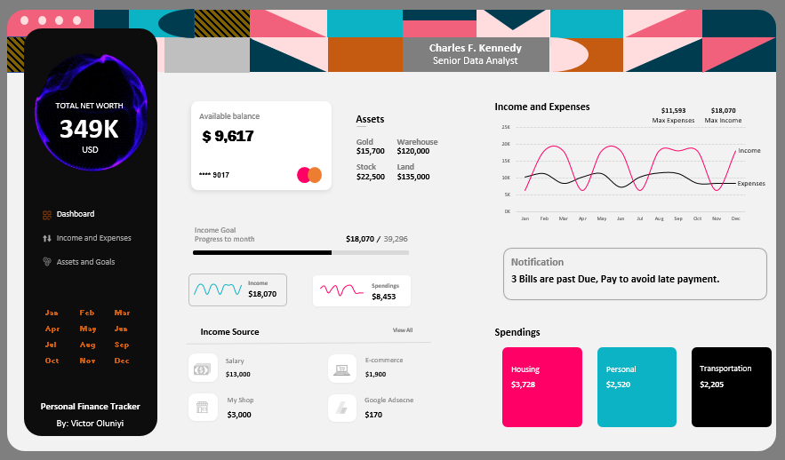

Hello there, Nice to have you here!!!👋

<h1 align="center">Hi 👋, I'm Victor Oluniyi</h1>
<h3 align="center">A passionate Data Analyst/Business Analyst</h3>

  

- 🔭 I’m a data analyst and business analyst, and i help businesses make intelligible/data driven decisions by drawing out actionable insights from business data. I also help in designing structured database for business

- 🌱 I’m currently learning **SQL**

- 👯 I’m looking to collaborate on **any interesting data analysis projects**

- 💬 Ask me about **Data Analytics, Business Development**

- 📫 How to reach me: **voluniyi@gmail.com**

- ⚡ Fun fact: **Reading, Travelling**

## <h3 align="left">Connect with me:</h3>

## <h3 align="left">Languages and Tools:</h3>

          
&nbsp;

 
